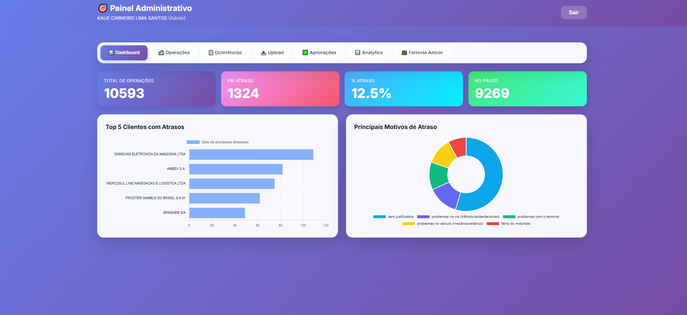

<div align="center">

# 🚢 Logistics Tracking System

### Sistema Completo de Rastreamento e Gestão de Cargas

[](LICENSE)
[](https://nodejs.org/)
[](http://makeapullrequest.com)

[Funcionalidades](#-funcionalidades) •
[Tecnologias](#-tecnologias) •
[Instalação](#-instalação) •
[Documentação](#-documentação) •
[Contribuir](#-contribuindo)



</div>

---

## 📋 Sobre o Projeto

Plataforma web **full-stack** moderna para gestão completa de operações logísticas, oferecendo rastreamento em tempo real, análises avançadas e relatórios personalizados. Desenvolvida para empresas de transporte marítimo, cabotagem, ferroviário e operações multimodais.

### ✨ Principais Funcionalidades

<table>
<tr>
<td width="50%">

#### 📊 Dashboard Operacional
Visão consolidada em tempo real de todas as cargas em trânsito com filtros avançados e alertas inteligentes

</td>
<td width="50%">

#### 📈 Analytics & KPIs
Análises detalhadas com gráficos interativos, indicadores de performance e comparativos históricos

</td>
</tr>
<tr>
<td width="50%">

#### 🔍 Tracking Inteligente
Rastreamento completo com histórico de eventos, cálculo automático de atrasos e notificações

</td>
<td width="50%">

#### 🚂 Módulo Railway
Gestão específica para operações ferroviárias com controle de vagões e composições

</td>
</tr>
<tr>
<td width="50%">

#### 📤 Upload Automatizado
Importação em massa via Excel com validação, processamento assíncrono e relatórios

</td>
<td width="50%">

#### 👥 Portal do Cliente
Acesso seguro e personalizado com permissões granulares e multi-tenant

</td>
</tr>
</table>

---

## 🛠️ Tecnologias

<div align="center">

### Backend

<p>
  
  
  
  
</p>

### Frontend

<p>
  
  
  
  
</p>

### DevOps & Infraestrutura

<p>
  
  
  
  
</p>

### Bibliotecas & Ferramentas

<p>
  
  
  
</p>

</div>

---

## 📁 Estrutura do Projeto

```
tracking-system/
├── 📂 backend/
│   ├── server.js                    # Servidor Express principal
│   ├── 📂 config/
│   │   ├── database.js              # Configuração Supabase
│   │   └── firebase.js              # Configuração Firebase Auth
│   ├── 📂 routes/
│   │   ├── tracking.js              # Rotas de rastreamento
│   │   ├── analytics.js             # Rotas de análises
│   │   ├── railway.js               # Rotas do módulo ferroviário
│   │   └── upload.js                # Rotas de upload
│   ├── 📂 middleware/
│   │   ├── auth.js                  # Middleware de autenticação
│   │   └── roles.js                 # Controle de permissões
│   └── 📂 utils/
│       ├── delays.js                # Cálculo de atrasos
│       └── timezone.js              # Gestão de fusos horários
├── 📂 frontend/
│   ├── index.html                   # Dashboard principal
│   ├── analytics.html               # Página de analytics
│   ├── railway.html                 # Módulo ferroviário
│   ├── 📂 js/
│   │   ├── auth.js                  # Autenticação frontend
│   │   ├── dashboard.js             # Lógica do dashboard
│   │   ├── analytics.js             # Visualizações e gráficos
│   │   ├── tracking.js              # Rastreamento de cargas
│   │   └── upload.js                # Upload de arquivos
│   └── 📂 css/
│       └── styles.css               # Estilos globais
├── 📂 database/
│   └── schema.sql                   # Schema do banco de dados
├── .env.example                     # Exemplo de variáveis de ambiente
├── package.json
└── README.md
```

---

## 🚀 Instalação

### Pré-requisitos

-  Node.js v16 ou superior
-  NPM ou Yarn
-  Conta Supabase (banco de dados)
-  Projeto Firebase (autenticação)

### 📦 Instalação Rápida

```bash
# Clone o repositório
git clone https://github.com/kauessz/tracking.git
cd tracking

# Instale as dependências
npm install

# Configure as variáveis de ambiente
cp .env.example .env
# Edite o arquivo .env com suas credenciais

# Configure o banco de dados
# Execute o arquivo database/schema.sql no Supabase

# Inicie o servidor
npm run dev
```

### ⚙️ Configuração Detalhada

<details>
<summary><b>1. Variáveis de Ambiente</b></summary>

Crie um arquivo `.env` na raiz do projeto:

```env
# Servidor
PORT=3000
NODE_ENV=production

# Supabase Database
SUPABASE_URL=https://your-project.supabase.co
SUPABASE_KEY=your-supabase-anon-key

# Firebase Authentication
FIREBASE_API_KEY=your-firebase-api-key
FIREBASE_AUTH_DOMAIN=your-project.firebaseapp.com
FIREBASE_PROJECT_ID=your-project-id
FIREBASE_STORAGE_BUCKET=your-project.appspot.com
FIREBASE_MESSAGING_SENDER_ID=your-sender-id
FIREBASE_APP_ID=your-app-id

# Configurações Adicionais
CORS_ORIGIN=https://your-domain.com
JWT_SECRET=your-jwt-secret
```

</details>

<details>
<summary><b>2. Banco de Dados</b></summary>

Execute os scripts SQL no painel do Supabase:

1. Acesse seu projeto no [Supabase](https://supabase.com)
2. Vá em **SQL Editor**
3. Execute o arquivo `database/schema.sql`
4. Verifique se as tabelas foram criadas corretamente
5. Configure as políticas de RLS (Row Level Security)

</details>

<details>
<summary><b>3. Firebase Setup</b></summary>

1. Crie um projeto no [Firebase Console](https://console.firebase.google.com)
2. Ative o Authentication
3. Configure os métodos de login (Email/Password, Google, etc)
4. Copie as credenciais para o arquivo `.env`
5. Configure as regras de segurança

</details>

### 🎯 Scripts Disponíveis

```bash
npm run dev          # Inicia servidor em modo desenvolvimento
npm start            # Inicia servidor em modo produção
npm test             # Executa testes
npm run lint         # Verifica código com ESLint
npm run build        # Build para produção
```

---

## 🔐 Autenticação & Segurança

### Sistema de Roles e Permissões

O sistema implementa autenticação robusta via Firebase com controle granular de permissões:

| Role | Descrição | Permissões |
|------|-----------|------------|
| 🔴 **Admin** | Administrador do sistema | Acesso total, gerenciamento de usuários |
| 🟡 **Operacional** | Equipe operacional | Dashboard, operações, relatórios |
| 🟢 **Cliente** | Clientes externos | Portal restrito, consulta de cargas |
| 🔵 **Viewer** | Visualização apenas | Acesso somente leitura |

### Estrutura de Claims JWT

```javascript
{
  uid: "user-unique-id",
  email: "user@company.com",
  role: "admin",
  company: "company-id",
  permissions: ["read", "write", "delete"],
  customClaims: {
    department: "operations",
    region: "BR"
  }
}
```

### Middleware de Autenticação

```javascript
// Exemplo de uso
app.get('/api/tracking', 
  authenticateToken,
  checkRole(['admin', 'operacional']),
  getTrackingData
);
```

---

## 📊 Módulos do Sistema

### 1️⃣ Dashboard Operacional

 

**Funcionalidades:**
- ✅ Visão em tempo real de todas as cargas
- ✅ Sistema de filtros avançados (status, rota, cliente, período)
- ✅ Alertas automáticos de atraso
- ✅ Busca inteligente e rápida
- ✅ Exportação de dados (Excel, CSV, PDF)
- ✅ Atualização automática a cada 30 segundos

**Métricas Exibidas:**
- Total de cargas em trânsito
- Cargas atrasadas vs no prazo
- Tempo médio de trânsito
- Taxa de pontualidade

---

### 2️⃣ Analytics & Relatórios

 

**Análises Disponíveis:**
- 📈 Gráficos de atrasos por período (diário, semanal, mensal)
- 📊 Análise de rotas e performance por trajeto
- 📉 Indicadores de performance (KPIs)
- 📋 Comparativos históricos e tendências
- 🎯 Análise de causas de atraso
- 💹 Previsão de tempo de trânsito

**Tipos de Gráficos:**
- Linhas (tendências temporais)
- Barras (comparativos)
- Pizza (distribuições)
- Heatmap (análise geográfica)

---

### 3️⃣ Módulo Railway (Ferroviário)

 

**Recursos Específicos:**
- 🚂 Controle de vagões e composições
- 🔗 Tracking de embarques ferroviários
- 📍 Integração com terminais portuários
- ⏱️ Gestão de janelas de operação
- 📦 Controle de cargas por vagão
- 🗺️ Mapeamento de rotas ferroviárias

---

### 4️⃣ Sistema de Upload

 

**Capacidades:**
- 📤 Upload de planilhas Excel (.xlsx)
- ✔️ Validação automática de dados
- ⚡ Processamento em lote otimizado
- 📊 Relatórios de importação
- 🔄 Atualização em massa
- 🚨 Detecção de erros e duplicatas

**Formato de Planilha Esperado:**
| BL/Container | Cliente | Origem | Destino | ETA | Status |
|--------------|---------|--------|---------|-----|--------|
| BL123456     | ACME    | Santos | Manaus  | 2024-12-15 | Em Trânsito |

---

## 🌐 API Documentation

### Base URL
```
https://api.seu-dominio.com/api
```

### Authentication
Todas as requisições requerem token JWT no header:
```bash
Authorization: Bearer <your-jwt-token>
```

### Endpoints Principais

#### 📦 Tracking

<details>
<summary><code>GET</code> <code>/tracking</code> - Lista todas as cargas</summary>

**Query Parameters:**
```javascript
{
  status: 'em_transito' | 'entregue' | 'atrasado',
  cliente: 'string',
  origem: 'string',
  destino: 'string',
  dataInicio: 'YYYY-MM-DD',
  dataFim: 'YYYY-MM-DD',
  page: number,
  limit: number
}
```

**Response:**
```json
{
  "success": true,
  "data": [
    {
      "id": "uuid",
      "bl": "BL123456",
      "cliente": "ACME Corp",
      "origem": "Santos/SP",
      "destino": "Manaus/AM",
      "eta": "2024-12-15T10:00:00Z",
      "status": "em_transito",
      "atraso": 0,
      "created_at": "2024-12-01T08:00:00Z"
    }
  ],
  "pagination": {
    "total": 150,
    "page": 1,
    "limit": 20,
    "pages": 8
  }
}
```
</details>

<details>
<summary><code>GET</code> <code>/tracking/:id</code> - Detalhes de uma carga</summary>

**Response:**
```json
{
  "success": true,
  "data": {
    "id": "uuid",
    "bl": "BL123456",
    "informacoes": { },
    "historico": [
      {
        "evento": "Embarque realizado",
        "local": "Santos/SP",
        "data": "2024-12-01T14:00:00Z"
      }
    ]
  }
}
```
</details>

<details>
<summary><code>POST</code> <code>/tracking</code> - Criar nova carga</summary>

**Body:**
```json
{
  "bl": "BL123456",
  "cliente": "ACME Corp",
  "origem": "Santos/SP",
  "destino": "Manaus/AM",
  "eta": "2024-12-15",
  "mercadoria": "Eletrônicos"
}
```
</details>

#### 📈 Analytics

<details>
<summary><code>GET</code> <code>/analytics/delays</code> - Análise de atrasos</summary>

**Query Parameters:**
```javascript
{
  periodo: 'dia' | 'semana' | 'mes' | 'ano',
  dataInicio: 'YYYY-MM-DD',
  dataFim: 'YYYY-MM-DD'
}
```
</details>

<details>
<summary><code>GET</code> <code>/analytics/kpis</code> - Indicadores chave</summary>

**Response:**
```json
{
  "success": true,
  "data": {
    "totalCargas": 1250,
    "cargasAtrasadas": 45,
    "taxaPontualidade": 96.4,
    "tempoMedioTransito": 5.2
  }
}
```
</details>

#### 🚂 Railway

<details>
<summary><code>GET</code> <code>/railway/shipments</code> - Embarques ferroviários</summary>

Lista todos os embarques via ferrovia com detalhes de vagões e composições.
</details>

#### 📤 Upload

<details>
<summary><code>POST</code> <code>/upload/excel</code> - Upload de planilha</summary>

**Headers:**
```
Content-Type: multipart/form-data
```

**Body:**
```javascript
{
  file: File // arquivo .xlsx
}
```

**Response:**
```json
{
  "success": true,
  "message": "Arquivo processado com sucesso",
  "stats": {
    "total": 100,
    "inseridos": 95,
    "atualizados": 5,
    "erros": 0
  }
}
```
</details>

---

## ⚡ Recursos Especiais

### 🧮 Cálculo Inteligente de Atrasos

Sistema avançado que considera múltiplos fatores:

```javascript
// Exemplo de cálculo
const delay = calculateDelay({
  eta: '2024-12-15 10:00',
  ata: '2024-12-16 14:30',
  timezone: 'America/Manaus',
  port: 'Manaus',
  tolerance: 24, // horas
  considerWeekends: true,
  considerHolidays: true
});
```

**Fatores Considerados:**
- ⏰ Fusos horários diferentes (São Paulo, Manaus, etc)
- 📅 Dias úteis vs finais de semana
- 🏖️ Feriados nacionais e regionais
- 🎯 Tolerâncias específicas por porto
- 🌊 Condições climáticas (integração futura)

### 🔄 Sincronização em Tempo Real

- WebSocket para updates instantâneos
- Cache inteligente com Redis (opcional)
- Sincronização automática entre módulos
- Resolução de conflitos de dados

### 🔔 Sistema de Notificações

- **Email**: Alertas automáticos para atrasos
- **Dashboard**: Notificações em tempo real
- **Webhook**: Integração com sistemas externos
- **SMS**: Alertas críticos (configurável)

### 📊 Data Export

Suporte para múltiplos formatos:
- 📗 Excel (.xlsx)
- 📄 CSV
- 📕 PDF (relatórios formatados)
- 📘 JSON (API)

---

## 📱 Interface Responsiva

<div align="center">

| Desktop | Tablet | Mobile |
|---------|--------|--------|
|  |  |  |

</div>

O sistema é **100% responsivo** e funciona perfeitamente em:
- 🖥️ Desktop (1920x1080 e superiores)
- 📱 Tablets (768px - 1024px)
- 📲 Smartphones (320px - 767px)

---

## 🚀 Deploy

### Opções de Hospedagem

<table>
<tr>
<td width="33%" align="center">

#### Railway
[](https://railway.app)

Recomendado para backend

</td>
<td width="33%" align="center">

#### Render
[](https://render.com)

Alternativa ao Railway

</td>
<td width="33%" align="center">

#### Netlify
[](https://netlify.com)

Ideal para frontend

</td>
</tr>
</table>

### Deploy Automático (CI/CD)

Configure deploy automático via GitHub Actions:

```yaml
# .github/workflows/deploy.yml
name: Deploy to Production

on:
  push:
    branches: [ main ]

jobs:
  deploy:
    runs-on: ubuntu-latest
    steps:
      - uses: actions/checkout@v3
      - uses: actions/setup-node@v3
        with:
          node-version: '18'
      - run: npm install
      - run: npm run build
      - run: npm run deploy
```

### Variáveis de Ambiente em Produção

```bash
# Railway/Render
railway variables set SUPABASE_URL=xxx
railway variables set FIREBASE_API_KEY=xxx

# Ou via dashboard
```

---

## 🐛 Troubleshooting

### Problemas Comuns e Soluções

<details>
<summary><b>❌ Erro de Conexão com Supabase</b></summary>

**Sintomas:** `Error: Failed to connect to database`

**Soluções:**
1. Verifique as credenciais no `.env`
2. Confirme se o IP está na whitelist do Supabase
3. Teste a conexão manualmente:
```bash
curl https://YOUR_PROJECT.supabase.co/rest/v1/
```
</details>

<details>
<summary><b>📤 Upload de Excel não Funciona</b></summary>

**Sintomas:** Arquivo não é processado ou retorna erro

**Soluções:**
1. Verifique o formato (deve ser `.xlsx`)
2. Confirme se as colunas estão corretas
3. Verifique o tamanho do arquivo (limite: 10MB)
4. Confira os logs do servidor
</details>

<details>
<summary><b>🔐 Problemas de Autenticação</b></summary>

**Sintomas:** `Token expired` ou `Unauthorized`

**Soluções:**
1. Limpe o cache do navegador
2. Faça logout e login novamente
3. Verifique se o token Firebase não expirou
4. Confirme as configurações do Firebase
</details>

<details>
<summary><b>📊 Gráficos não Aparecem</b></summary>

**Sintomas:** Dashboard vazio ou gráficos quebrados

**Soluções:**
1. Verifique o console do navegador
2. Confirme se o Chart.js está carregado
3. Valide os dados retornados pela API
4. Limpe o cache e recarregue
</details>

<details>
<summary><b>⚡ Performance Lenta</b></summary>

**Soluções:**
1. Implemente paginação nos endpoints
2. Adicione índices no banco de dados
3. Configure cache (Redis)
4. Otimize queries SQL
5. Reduza o payload das respostas
</details>

### 🆘 Logs e Debugging

```bash
# Ver logs em tempo real
npm run logs

# Debug mode
NODE_ENV=development DEBUG=* npm run dev

# Logs específicos
DEBUG=express:* npm run dev
```

---

## 🗺️ Roadmap

### ✅ Versão 1.0 (Atual)
- [x] Sistema de tracking completo
- [x] Dashboard operacional
- [x] Analytics com Chart.js
- [x] Módulo Railway
- [x] Sistema de upload Excel
- [x] Autenticação Firebase
- [x] API REST completa

### 🚧 Versão 2.0 (Em Desenvolvimento)
- [ ] Integração com APIs de rastreamento externas
- [ ] Sistema de notificações push
- [ ] Relatórios PDF automatizados
- [ ] Dashboard em tempo real (WebSocket)
- [ ] Cache com Redis
- [ ] Testes automatizados (Jest)

### 🔮 Versão 3.0 (Planejado)
- [ ] App mobile (React Native)
- [ ] Integração com ERPs
- [ ] IA para previsão de atrasos
- [ ] Blockchain para rastreabilidade
- [ ] Multi-idioma (i18n)
- [ ] API GraphQL

---

## 🤝 Contribuindo

Contribuições são sempre bem-vindas! 🎉

### Como Contribuir

1. **Fork** o projeto
2. Crie uma **branch** para sua feature (`git checkout -b feature/NovaFuncionalidade`)
3. **Commit** suas mudanças (`git commit -m 'Add: Nova funcionalidade incrível'`)
4. **Push** para a branch (`git push origin feature/NovaFuncionalidade`)
5. Abra um **Pull Request**

### Padrões de Commit

Seguimos o padrão [Conventional Commits](https://www.conventionalcommits.org/):

```
feat: adiciona nova funcionalidade
fix: corrige bug específico
docs: atualiza documentação
style: formatação de código
refactor: refatoração sem mudança de funcionalidade
test: adiciona ou modifica testes
chore: tarefas de manutenção
```

### Code Style

- **JavaScript**: ES6+
- **Indentação**: 2 espaços
- **Nomenclatura**: camelCase para variáveis, PascalCase para classes
- **Comentários**: em português para domínio de negócio

---

## 📄 Licença

Este projeto está sob a licença MIT. Veja o arquivo [LICENSE](LICENSE) para mais detalhes.

```
MIT License

Copyright (c) 2025 Logistics Tracking System

Permission is hereby granted, free of charge, to any person obtaining a copy...
```

---

## 👨‍💻 Autor

<div align="center">

### Kauê Santos

[](https://github.com/kauessz)
[](mailto:ssz.kaue@gmail.com)
[](https://linkedin.com/in/kaue-santos)

**Full-Stack Developer** | **15+ anos em Logística** | **Entusiasta de Tecnologia**

</div>

---

## 🙏 Agradecimentos

Agradecimentos especiais a:

- **Supabase** pela infraestrutura de banco de dados
- **Firebase** pelo sistema de autenticação robusto
- **Chart.js** pelas visualizações incríveis
- **Comunidade Open Source** por todas as bibliotecas utilizadas

---

## 📞 Suporte

Encontrou algum problema? Tem alguma sugestão?

- 📧 Email: ssz.kaue@gmail.com
- 🐛 Issues: [GitHub Issues](https://github.com/kauessz/tracking/issues)
- 💬 Discussions: [GitHub Discussions](https://github.com/kauessz/tracking/discussions)

---

<div align="center">

### ⭐ Se este projeto foi útil, considere dar uma estrela!

[](https://github.com/kauessz/tracking)
[](https://github.com/kauessz/tracking/fork)
[](https://github.com/kauessz/tracking)

---

**Desenvolvido com ❤️ para a comunidade logística**

**Versão**: 1.0.0 | **Status**: ✅ Em Produção | **Última Atualização**: Dezembro 2025

[⬆ Voltar ao topo](#-logistics-tracking-system)

</div>