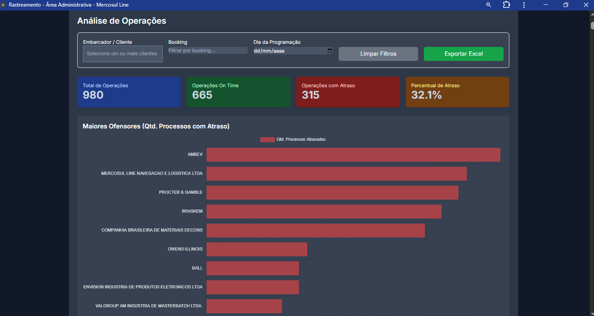
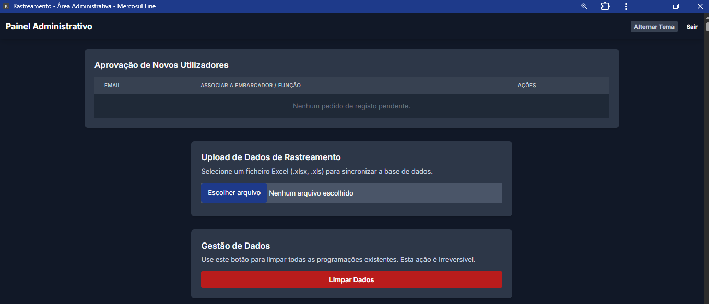
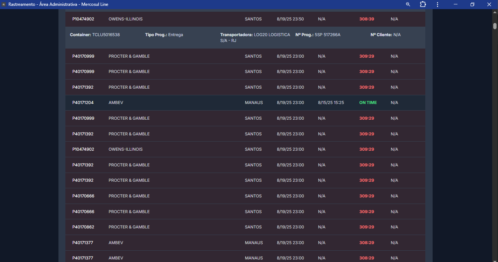

# 🚚 Rastreamento de Carga  

Aplicação web desenvolvida para **cabotagem e operações logísticas**, com foco em **controle de operações, dashboards e relatórios**.  
Projeto criado inicialmente para apoiar o dia a dia na logística, unindo experiência prática e tecnologia.

---

## ✨ Funcionalidades
- Upload de planilhas de operações
- Visualização de operações em **tempo real**
- Dashboards de **coleta, entrega e atrasos**
- Relatórios diários/mensais de desempenho
- Área de administração com gráficos interativos

---

## 🛠️ Tecnologias


---

## 📸 Demonstração
<!-- Aqui você pode adicionar prints da interface -->




---

## 🚀 Como rodar o projeto
```bash
# Clone o repositório
git clone https://github.com/kauessz/rastreamento.git

# Instale as dependências
npm install

# Execute em modo desenvolvimento
npm run dev
